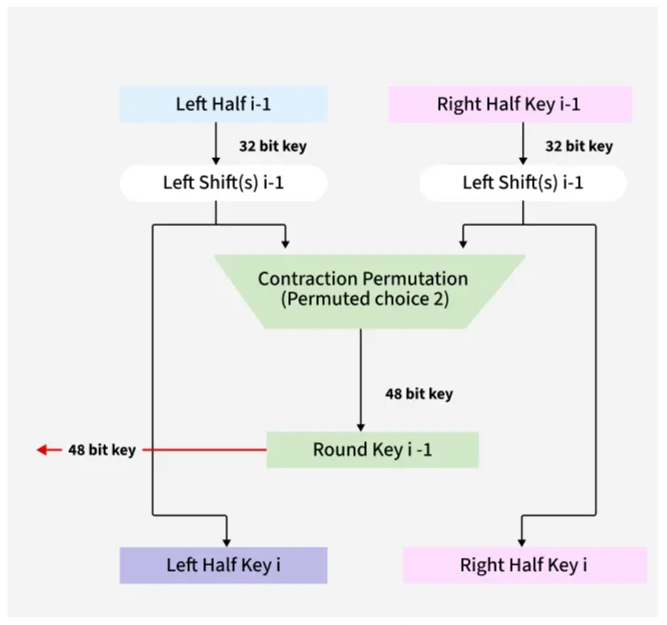
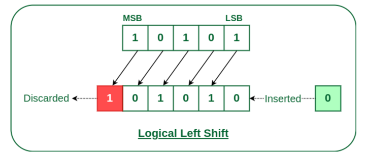
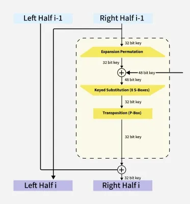
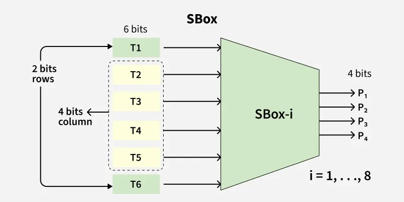

```shell
--- STARTING DES TEST ---
Plaintext (Hex): 0123456789ABCDEF
Key (Hex):       133457799BBCDFF1
Original Key (Bin): 0001001100110100010101110111100110011011101111001101111111110001
Key after PC-1 (56 bits): 11110000110011001010101011110101010101100110011110001111
C0: 1111000011001100101010101111
D0: 0101010101100110011110001111

--- Generating 16 Subkeys ---
Round  1: K = 000110110000001011101111111111000111000001110010 (Hex: 1B02EFFC7072)
Round  2: K = 011110011010111011011001110110111100100111100101 (Hex: 79AED9DBC9E5)
Round  3: K = 010101011111110010001010010000101100111110011001 (Hex: 55FC8A42CF99)
Round  4: K = 011100101010110111010110110110110011010100011101 (Hex: 72ADD6DB351D)
Round  5: K = 011111001110110000000111111010110101001110101000 (Hex: 7CEC07EB53A8)
Round  6: K = 011000111010010100111110010100000111101100101111 (Hex: 63A53E507B2F)
Round  7: K = 111011001000010010110111111101100001100010111100 (Hex: EC84B7F618BC)
Round  8: K = 111101111000101000111010110000010011101111111011 (Hex: F78A3AC13BFB)
Round  9: K = 111000001101101111101011111011011110011110000001 (Hex: E0DBEBEDE781)
Round 10: K = 101100011111001101000111101110100100011001001111 (Hex: B1F347BA464F)
Round 11: K = 001000010101111111010011110111101101001110000110 (Hex: 215FD3DED386)
Round 12: K = 011101010111000111110101100101000110011111101001 (Hex: 7571F59467E9)
Round 13: K = 100101111100010111010001111110101011101001000001 (Hex: 97C5D1FABA41)
Round 14: K = 010111110100001110110111111100101110011100111010 (Hex: 5F43B7F2E73A)
Round 15: K = 101111111001000110001101001111010011111100001010 (Hex: BF918D3D3F0A)
Round 16: K = 110010110011110110001011000011100001011111110101 (Hex: CB3D8B0E17F5)
After IP: 1100110000000000110011001111111111110000101010101111000010101010
S-Box Output (Hex): 5C82B597
Round  1: L=F0AAF0AA, R=EF4A6544
S-Box Output (Hex): F8D03AAE
Round  2: L=EF4A6544, R=CC017709
S-Box Output (Hex): 2710E16F
Round  3: L=CC017709, R=A25C0BF4
S-Box Output (Hex): 21ED9F3A
Round  4: L=A25C0BF4, R=77220045
S-Box Output (Hex): 50C831EB
Round  5: L=77220045, R=8A4FA637
S-Box Output (Hex): 41F34C3D
Round  6: L=8A4FA637, R=E967CD69
S-Box Output (Hex): 107540AD
Round  7: L=E967CD69, R=064ABA10
S-Box Output (Hex): 6C187CAE
Round  8: L=064ABA10, R=D5694B90
S-Box Output (Hex): 110C5777
Round  9: L=D5694B90, R=247CC67A
S-Box Output (Hex): DA045275
Round 10: L=247CC67A, R=B7D5D7B2
S-Box Output (Hex): 7305D101
Round 11: L=B7D5D7B2, R=C5783C78
S-Box Output (Hex): 7B8B2635
Round 12: L=C5783C78, R=75BD1858
S-Box Output (Hex): 9AD18B4F
Round 13: L=75BD1858, R=18C3155A
S-Box Output (Hex): 64799AF1
Round 14: L=18C3155A, R=C28C960D
S-Box Output (Hex): B2E88D3C
Round 15: L=C28C960D, R=43423234
S-Box Output (Hex): A7832429
Round 16: L=43423234, R=0A4CD995
S-Box Output (Hex): A7832429
S-Box Output (Hex): B2E88D3C
S-Box Output (Hex): 64799AF1
S-Box Output (Hex): 9AD18B4F
S-Box Output (Hex): 7B8B2635
S-Box Output (Hex): 7305D101
S-Box Output (Hex): DA045275
S-Box Output (Hex): 110C5777
S-Box Output (Hex): 6C187CAE
S-Box Output (Hex): 107540AD
S-Box Output (Hex): 41F34C3D
S-Box Output (Hex): 50C831EB
S-Box Output (Hex): 21ED9F3A
S-Box Output (Hex): 2710E16F
S-Box Output (Hex): F8D03AAE
S-Box Output (Hex): 5C82B597

--- FINAL RESULT ---
Calculated Ciphertext: 85E813540F0AB405
Expected Ciphertext:   85E813540F0AB405
Calculated Plain: 0123456789ABCDEF
Expected Plaintext:   0123456789ABCDEF
```



Logical left shift


Feistel


SBox
